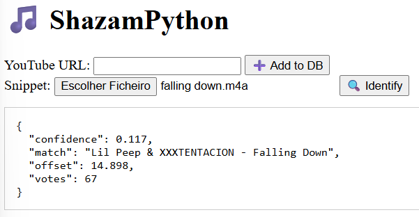

# 🎵 ShazamPython

A simplified Shazam-like application built in Python. This project allows you to identify music tracks by analyzing short audio snippets using audio fingerprinting techniques.

> ⚠️ **Goal**: This project aimed to implement Shazam **without using external libraries**, but due to Python’s performance limitations for certain low-level operations (especially FFT and audio processing), some libraries like `NumPy` and `yt-dlp` were used to make it viable. It still fails from time to time but it has a good accuracy.

---

## 🔍 What does it do?

- Extracts unique fingerprints from audio files or YouTube videos.
- Stores these fingerprints in a local SQLite database.
- Matches uploaded audio snippets against the database to identify songs.
- Includes a simple web interface using Flask.

---

## 🧠 How does it work?

1. The full song is converted to WAV and split into overlapping windows.
2. Each window goes through Hamming windowing + FFT to extract frequency peaks.
3. Fingerprint hashes are generated from peak pairs and time offsets.
4. These hashes are stored in a SQLite database.
5. Snippets are matched by comparing hashes and identifying time offsets that align.

---

## 💻 Demo



---

## 🚀 Installation & Running

### ✅ Prerequisites

- Python 3.8+
- `ffmpeg` (included as `ffmpeg.exe` in the project folder or installed globally)
- `pip` package manager

### 📦 Install dependencies

```bash
git clone https://github.com/gustavo5506/ShazamPython.git
cd ShazamPython
pip install -r requirements.txt
```

### ▶️ Run the server

```bash
python -m server.server
```

Then open your browser and go to:

```
http://localhost:5000
```

You will see a simple web interface where you can:

- Paste a **YouTube URL** to download and fingerprint a song (adds it to the database)
- Upload an **audio snippet** (e.g. `.wav`, `.m4a`, etc.) between 10s and 20s to try and identify it

---

## 🧪 Technologies Used

- **Python** – main programming language  
- **Flask** – lightweight web framework  
- **NumPy** – used for FFT and array operations  
- **yt-dlp** – YouTube audio downloader  
- **SQLite** – embedded database to store fingerprints  
- **ffmpeg** – required for audio conversion (must be available as `ffmpeg.exe`)

---


## ⚠️ Project Goal

This project was originally meant to recreate Shazam **entirely without external libraries**.  
However, due to Python's performance limitations — especially with real-time signal processing and FFT — external tools like `NumPy` and `yt-dlp` were used to make the system feasible, performant, and reliable.

---

## 📄 License

MIT © [gustavo5506](https://github.com/gustavo5506)
